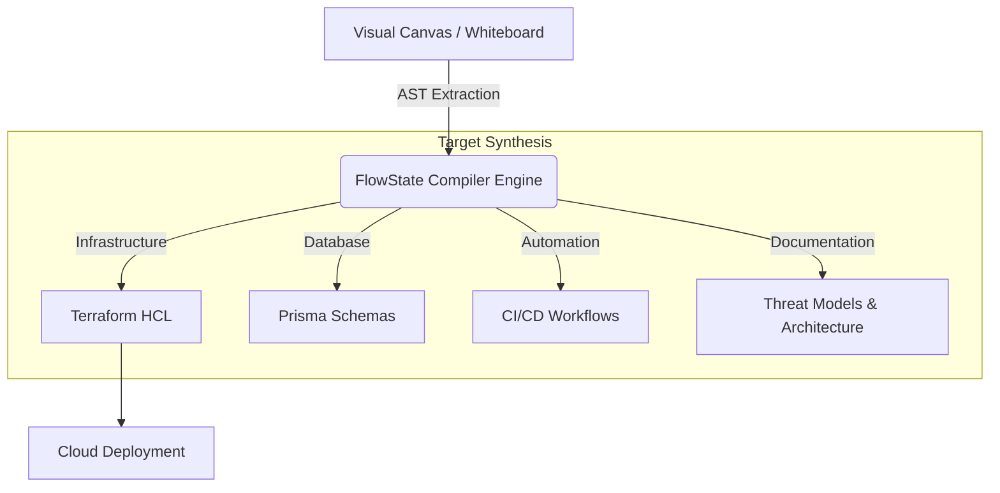

# Genesis FlowState

  

**FlowState** is a next-generation Visual Compiler and IDE for Cloud Engineers. It bridges the gap between system architecture design and Infrastructure as Code (IaC) by allowing you to design system topologies on an interactive visual canvas and automatically compile them into clean, ready-to-deploy HashiCorp Terraform configurations, Prisma schemas, and comprehensive documentation.

## 🚀 Features

- **Visual Architecture Canvas**: Design your cloud infrastructure using an intuitive drag-and-drop whiteboard. No more mental mapping—see your architecture as you build it.
- **Instant IaC Compilation**: FlowState automatically compiles your visual nodes and connections into production-ready HashiCorp HCL (Terraform) with zero legacy dependencies.
- **Vibe Coding Environment**: A fully integrated, browser-based mock IDE experience that lets you review multi-language targets, run live security audits, and view output logs natively tied to your diagram.
- **Real-Time Security Auditing**: Automatically generates threat models and architecture documentation, validating rules like encryptions (SSE-KMS) and permissive Security Groups.
- **B2B SaaS Ready**: Beautiful, high-performance dark-mode interface built with modern web aesthetics, dynamic scroll animations, and interactive elements.
- **Architecture Templates**: Built-in interactive playgrounds for standard three-tier web apps, serverless REST APIs, and event-driven microservices.

## 🧠 How It Works

FlowState parses the visual graph (nodes and edges) from your whiteboard session and translates it into an Abstract Syntax Tree (AST). The internal compiler then synthesizes this AST into various development artifacts.

1. **Design**: Drag and drop nodes representing cloud primitives (ALBs, EC2 ASGs, DynamoDB, Lambda, etc.) on the canvas.
2. **Compile**: Click to run the FlowState compiler. The visual AST is parsed in real-time.
3. **Review**: Check the generated artifacts in the built-in IDE environment. Review Terraform `.tf` files, Prisma schemas, and GitHub Actions workflows.
4. **Deploy**: Take the synthesized code and run it in your CLI to deploy your robust, automated architecture.

## 🛠️ Technology Stack

- **Framework**: [Next.js 14](https://nextjs.org/) (App Router)
- **Language**: [TypeScript](https://www.typescriptlang.org/)
- **Styling**: [Tailwind CSS](https://tailwindcss.com/)
- **Animations**: [Framer Motion](https://www.framer.com/motion/) for fluid, declarative scroll and interactive animations.
- **3D / WebGL**: [OGL](https://github.com/oframe/ogl) for high-performance, lightweight WebGL backgrounds (Lightfall, LightPillar).
- **Icons**: [Lucide React](https://lucide.dev/)
- **State Management**: React Hooks (`useState`, `useEffect`, `useTransform`)
- **Authentication**: Custom Auth integration hooks (`useAuth`).

## 💻 Getting Started

### Prerequisites

- Node.js 18.x or higher
- npm or yarn

### Installation

1. Clone the repository:
   \`\`\`bash
   git clone https://github.com/Vishal-V-D/Genesis-Flowstate.git
   cd Genesis-Flowstate
   \`\`\`

2. Install dependencies:
   \`\`\`bash
   npm install
   \`\`\`

3. Run the development server:
   \`\`\`bash
   npm run dev
   \`\`\`

4. Open [http://localhost:3000](http://localhost:3000) with your browser to see the result.

## 🏗️ Project Structure

- \`src/app\`: Next.js App Router pages and layouts.
- \`src/components/landing\`: Modular UI components for the landing page (e.g., \`PricingSection\`, \`SandboxSection\`, \`IDEPreviewSection\`).
- \`src/components/ui\`: Reusable UI elements and complex WebGL components like \`Lightfall\` and \`LightPillar\`.
- \`src/hooks\`: Custom React hooks for authentication and state management.

## 📄 License

This project is licensed under the MIT License.
